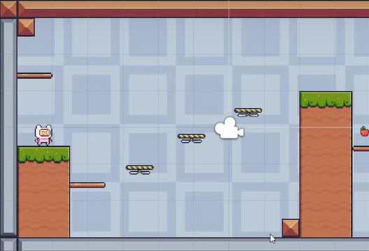
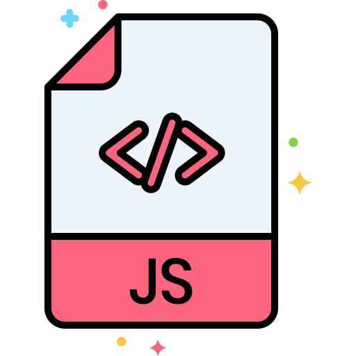

# jogo-teste1 
# Jogo desenvolvido em formato 2D

 <H1 align="center">Tela de amostragem do jogo</H1>

 

# Linguagem utilizada

Desenvolvimento com a ferramenta  <a href="https://unity.com/download">Site para efetuar o Dowloand do programa</a>

Desenvolvimento em  

 
Jogo desenvolvido pelo canal no  <a href="https://www.youtube.com/watch?v=sFo_DLf4-EA">you tube</a> 📺 

